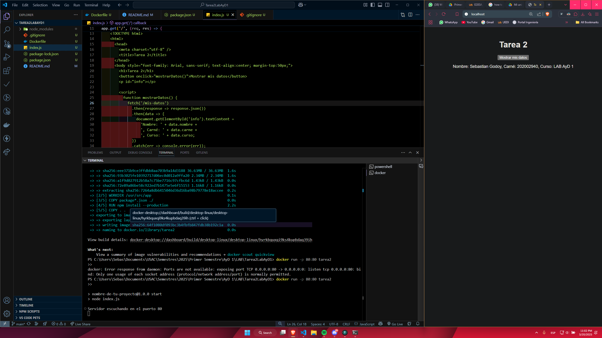
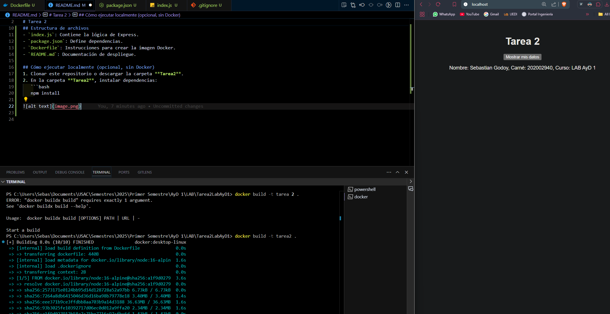

# Tarea2LabAyD1
# Tarea 2

Este proyecto crea una página web sencilla que muestra un botón y, al presionarlo, devuelve **nombre**, **carné** y **curso**.

## Requisitos
- [Docker](https://www.docker.com/) instalado

## Estructura de archivos
- `index.js`: Contiene la lógica de Express.
- `package.json`: Define dependencias.
- `Dockerfile`: Instrucciones para crear la imagen Docker.
- `README.md`: Documentación de despliegue.

## Cómo ejecutar
1. Clonar este repositorio o descargar la carpeta **Tarea2**.
2. En la carpeta **Tarea2**, instalar dependencias:
   ```bash
   npm install

    ```
3. Construir la imagen Docker:
    ```bash
    docker build -t tarea2 .
    ```

4. Ejecutar la imagen Docker:
    ```bash
    docker run -p 80:80 tarea2
    ```




